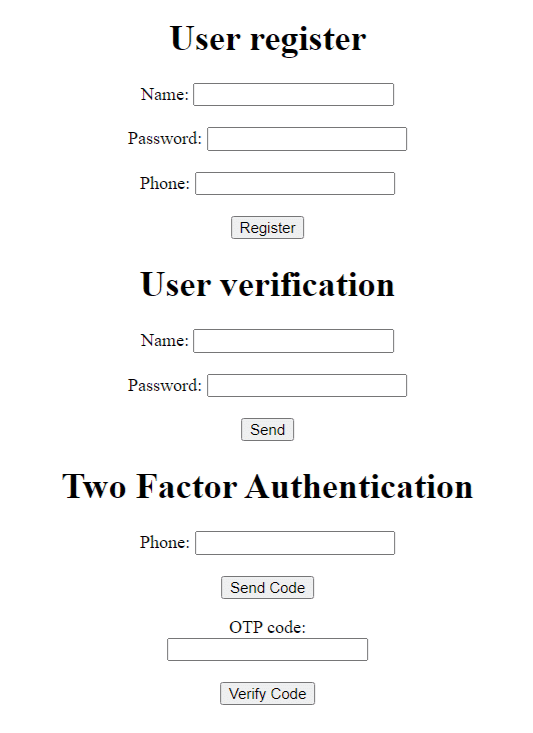

# Cybersecurity Project

# About project 

This project consists of a secure login system developed in Python. So far, the basic structure of registration and name and password verification has been developed. The first security mechanism consists of encrypting passwords using _bcrypt_, a data encryption library.
Then two-factor authentication (2FA) was implemented.

## Examples

* create_table(): Creates a table in the SQLite database to store user information if the table doesn't exist.

* create_password_hash(passw): Generates an encrypted password hash using the bcrypt library.

* register_user(name, passw, number_phone): Registers a new user in the database, storing the name, encrypted password, and phone number.

* verify_hash_passw(passw, hash_passw): Verifies if a password matches an encrypted password hash.

* verify_user(name, passw): Verifies if the provided username and password correspond to a registered user in the database.

* create_verify_service(): Creates a verification service using the Twilio API and returns the service_sid for the created service.

* send_verification_sms(number_phone): Sends a verification request via SMS to the provided phone number using the Twilio verification service.

Flask Routes:

* /: Initial route that renders the index.html template.

* /register: Route for registering a new user. Form data is extracted and validated before calling the register_user function to insert the user details into the database.

* /verify: Route for authenticating a user. Form data is extracted and verified by calling the verify_user function. If the authentication is successful, a success message is rendered; otherwise, a failure message is displayed.

* /twofactor: Route for performing two-factor authentication (2FA). The phone number and OTP code are extracted from the form.
The send_verification_sms function is called to send the verification request via SMS. 
Then, the provided OTP code is verified, and a message indicating whether the verification was approved or failed is rendered.

#### *note: project under development and resolving problems in production*

### Interface
A simple visualization, because the focus is on the backend.  

# Technologies

- Python 3.9.11
- Librarys Python: sqlite3, bcrypt, flask.render_template, twilio.rest.Client, requests.
- Framework Flask 2.3.2
- SQlite 3.35.5.
- API Twilio
- DB Browser for SQLite Version 3.12.2
- IDE PyCharm 2022.3.1 (Community Edition)

# How to run the project
 
Make sure you have Python installed. 
Also, install Pipenv if you don't already have it by running the following command:

*pip install pipenv*

 

1. Clone the repository:

    *git clone: https://github.com/Micheleregina2022/cybersecurityProject.git*

2. Navigate to the project directory:

    *cd repository-name*

3. Install project dependencies using Pipenv:

    *pipenv install --dev*

4. Activate the Pipenv virtual environment:

    *pipenv shell*

5. Install dependencies:

   *pip install -r requirements.txt*

6. Run the application:

    *python app.py*

## Using the API and Testing the Project

To use the API and test the project, please follow the instructions below:

1. Twilio Account Setup:

If you haven't already, create a Twilio account at Twilio.com (it's free!).
Retrieve your Account SID and Auth Token from the Twilio dashboard. 

2. Environment Setup:

Open the app.py file in a text editor.

Replace the values of the account_sid, auth_token, and service_sid variables with your Twilio account information.

Open the terminal and navigate to the project folder.

Start the server by running the following command:

 *python app.py*

The server will run on port 5000.

3. Using the Project:

Open your web browser and visit http://localhost:5000 to access the project's home page.

You will see fields for registration and login.

To test the two-factor verification, enter your phone number and the OTP (verification code) received via SMS. 

Based on the verification, you will receive a message indicating whether access is granted or denied.

# Author
Michele Regina Bora  
https://www.linkedin.com/in/michele-regina-bora/

